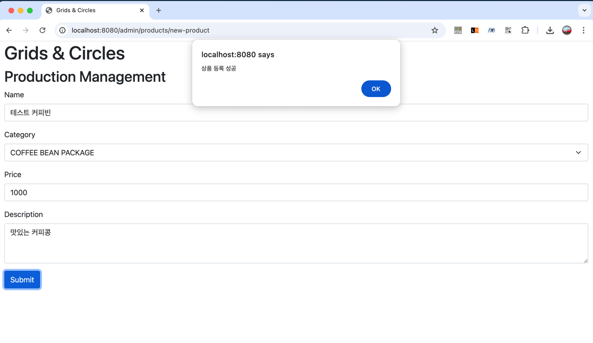

# 데브코스 백엔드 전공 1차 팀프로젝트 2팀 
## Goal: 커피-주문 API 만들기

### 필수 구현 기능

토글 접기/펼치기

- 제품 CRUD
    - [x]  제품 생성 기능
        - `product_name`, `category`, `price`, `description` 으로 제품을 생성할 수 있다.
    - [x]  제품 조회 기능
        - 제품 전체를 조회 할 수 있다.
            - `product_name`
        - 제품 상세 페이지를 조회 할 수 있다.
            - `product_name`, `category`, `price`, `description`
    - [x]  제품 수정 기능
        - `제품 식별값`으로 제품을 수정할 수 있다.
        - 수정 항목: `price` , `description`
    - [x]  제품 삭제 기능
        - `제품 식별값`으로 제품을 삭제할 수 있다.
- 주문 CRUD
    - [x]  주문 생성 기능
        - `order_items`, `email, address`, `postcode`으로 주문을 생성할 수 있다.
            - `order_items`는 `product_id`, `quantity`으로 구성된다.
    - [x]  주문 조회 기능
        - `email` 값으로 주문 리스트를 조회할 수 있다.
        - `주문 식별` 값으로 단건 주문을 조회할 수 있다.
    - [x]  주문 수정 기능
        - `주문 식별값`으로 주문을 수정할 수 있다.
        - 수정 항목: `address`,  `postcode`
            - “주문 완료” 인 경우에만 주문 수정 가능
    - [x]  주문 삭제 기능
        - `주문 식별값`으로 주문을 삭제할 수 있다.
        - 주문 상태 : “주문 완료” , “배송 시작”
            - “주문 완료” 인 경우에만 주문 삭제 가능
- 배송 처리 기능
    - [x]  주문 완료인 주문을 배송 시작 상태로 변경할 수 있다.
        - 14시에 주문 완료 상태의 주문을 배송 시작 상태로 변경한다.

### 추가 구현 기능

토글 접기/펼치기

- View 연동
  - 관리자 페이지
    - [x] 제품을 리스트를 확인할 수 있다.
    - [x] 제품을 추가할 수 있다.
  - 주문 페이지
    - [x] 상품을 담을 수 있다.
    - [x] 주문을 생성할 수 있다.
- JPA -> Mybatis
  - [x] 제품 CRUD
  - [x] 주문 CRUD

### ERD

### API 명세서
[API 명세서]()

### View

토글 접기/펼치기

#### 관리자 페이지

- **상품 리스트 페이지**
    - 관리자 페이지에서 상품 리스트를 확인할 수 있다.
    - 상품 목록은 테이블 형식으로 표시되며, 각 상품의 `product_name`, `category`, `price`, `description` 등을 볼 수 있다.
    - 

- **상품 등록 페이지**
    - 새로운 상품을 등록할 수 있다.
    - 필수 입력 항목: `product_name`, `category`, `price`, `description`
    - 
    - 입력이 성공적으로 완료되면 성공 메시지가 보인다.
        - 
    - 입력이 실패할 경우, 실패 메시지가 보인다.
        - 

#### 주문 페이지

- **주문 페이지**
    - 고객이 주문을 등록할 수 있다.
    - 상품 목록에서 원하는 상품을 선택하여 주문할 수 있다.
    - - 
    - 주문 정보를 입력하고 제출하면 주문 성공 메시지가 보인다.
        - 
    

